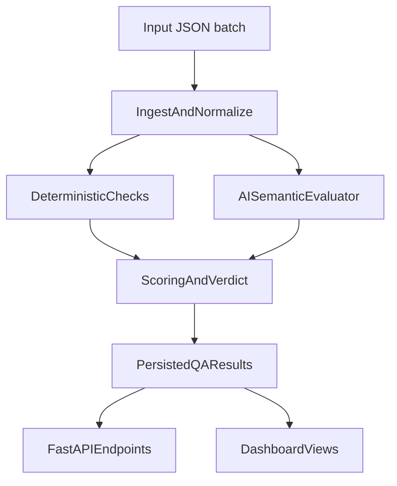

# Story QA Service - Automated Content Trust Checks

This project implements a backend-style **Content Trust & QA** service for high-volume Stories content.
It is packaged as a local runnable prototype for take-home review, but designed to map to a production worker/API flow.

## 1) Problem Framing

The core problem is not one-off moderation. It is a **scalable publishing confidence** challenge:

- Story volume is too high for reliable manual review.
- Quality, trust, and professional consistency can drift across pages, metadata, CTA links, and context.
- Teams need repeatable automatic checks that can run on every sync.

## 2) What This Builds

- FastAPI backend with repeatable QA run endpoint.
- Deterministic checks for structural and policy issues.
- AI semantic evaluator layer with real LLM support (`OPENAI_API_KEY`) and mock fallback.
- Scoring engine with:
  - Internal `risk_score`
  - Product-facing `trust_score` where `100 = best`
  - Verdict: `pass` / `review` / `block`
- SQLite persistence of runs and story-level issues.
- Web dashboard to inspect runs, story verdicts, and issue details.
- JSON + Markdown report generation for sharing with operations/product teams.

## 3) Architecture



## 4) Assumptions

- Input data is continuously synced in a structured shape similar to task examples.
- V1 acts as advisory trust gating (recommendation), not auto-publishing control.
- AI output must be structured and evidence-backed; deterministic checks remain first-class.
- Tenant-specific policies can be layered in after issue patterns are observed.

## 5) Run Locally

From project root:

```bash
cd /Users/mertcan/MyProjects/BMNova/story_trust
python3 -m pip install -r requirements.txt
```

Configure environment:

```bash
cp .env.example .env
# then set OPENAI_API_KEY in .env
```

Run a single automated QA batch from sample data:

```bash
python3 -m app.run_once --input data/sample_response.json --output output/qa_report.json --markdown output/qa_report.md --use-ai
```

Optional: provide explicit source label shown on dashboard:

```bash
python3 -m app.run_once --input data/sample_response.json --source-label "data/sample_response.json" --use-ai
```

Start backend + dashboard:

```bash
python3 -m uvicorn app.main:app --reload
```

Quick start script (backend + dashboard):

```bash
./run_dev.sh --install
```

Optional custom port:

```bash
./run_dev.sh --port 8010
```

Then open:

- API docs: <http://127.0.0.1:8000/docs>
- Dashboard: <http://127.0.0.1:8000/dashboard>
- Dashboard can trigger new runs directly via the **Trigger New Run** form.
- Trigger form supports both pasted JSON and **Upload JSON file** input.

Run tests:

```bash
pytest -q
```

Live LLM smoke test (runs only if API key exists in env):

```bash
python3 -m pytest -q tests/test_live_llm_smoke.py
```

## 6) API Endpoints

- `POST /qa/run` - run QA on incoming payload (`use_ai` and `persist` query params supported)
- `POST /qa/run` also accepts `source_label` query param for run provenance
- `GET /qa/runs` - list recent runs
- `GET /qa/runs/{run_id}` - run summary + story results
- `GET /qa/stories/{story_result_id}` - story detail with issues

## 7) Trust Score and Verdict Logic

- `trust_score = max(0, 100 - risk_score)`
- Verdict bands:
  - `85-100`: `pass`
  - `60-84`: `review`
  - `0-59`: `block`
- Overrides:
  - any `critical` issue => force `block`
  - any `high` issue => minimum `review`

## 8) Included Check Types

- Missing or invalid metadata (title, publish date, action URL, CTA)
- Unsupported media types
- Duplicate page IDs
- CTA destination mismatch (for example: `Buy tickets` routed to `/highlights`)
- External domain risk checks
- AI semantic quality checks:
  - weak context coverage for matchup stories
  - tenant semantic mismatch
  - overly generic CTA language

## 9) LLM Configuration

- Provider failover is supported: evaluator tries providers in `STORY_TRUST_AI_PROVIDERS` order (default: `openai,gemini`).
- OpenAI:
  - `OPENAI_API_KEY`
  - `STORY_TRUST_LLM_MODEL` (default: `gpt-4o-mini`)
- Gemini:
  - `GEMINI_API_KEY` (or `GOOGLE_API_KEY`)
  - `STORY_TRUST_GEMINI_MODEL` (default: `gemini-2.5-flash-lite`)
- If a provider fails, evaluator tries the next provider; if all fail, it falls back to deterministic `mock-ai`.
- AI provider failures and fallback reasons are logged to `output/ai_evaluator.log`.
- `.env` is auto-loaded by both API server and CLI runner.

## 10) What Is Deliberately Not Built Yet

- Full visual moderation pipeline (frame-level or OCR-level checks)
- Tenant policy builder UI
- Queue/distributed workers (Celery/Kafka)
- Autonomous publish blocking in upstream CMS

## 11) What To Build Next With Engineering Support

- Event-driven worker integration on new/updated story sync
- Tenant-specific rule packs and allowlists
- Feedback loop (`correct issue`, `false positive`, `ignore`, `new rule`)
- Monitoring KPIs:
  - review rate
  - false positive rate
  - prevented trust incidents
  - time-to-fix for high-severity issues

