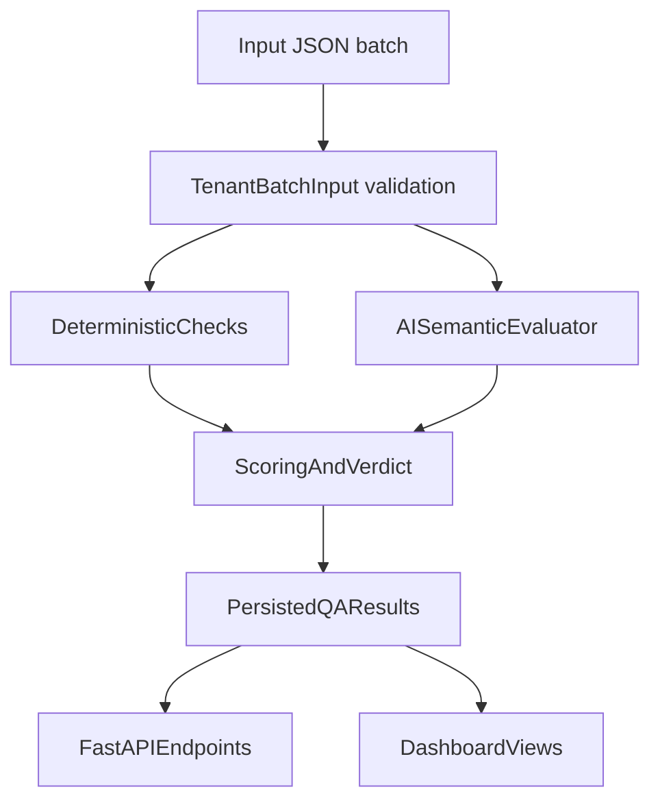

# Story QA Service — Automated Content Trust Checks

A backend-style **Content Trust & QA** service for high-volume Stories content: repeatable, automatic checks on every synced batch (not one-off manual review). The prototype runs locally; the same pipeline maps to a production worker or API on continuous ingest.

Reports are generated locally under `output/` (e.g. `qa_report.json`, `qa_report.md`) when you run the CLI below.

## 1) Problem Framing

The core problem is not one-off moderation. It is a **scalable publishing confidence** challenge:

- Story volume is too high for reliable manual review.
- Quality, trust, and professional consistency can drift across pages, metadata, CTA links, and context.
- Teams need repeatable automatic checks that can run on every sync.

## 2) What This Builds

- FastAPI backend with repeatable QA run endpoint.
- Deterministic checks for structural and policy issues.
- AI semantic evaluator layer with real LLM support (`OPENAI_API_KEY`) and mock fallback.
- Scoring engine with:
  - Internal `risk_score`
  - Product-facing `trust_score` where `100 = best`
  - Verdict: `pass` / `review` / `block`
- SQLite persistence of runs and story-level issues.
- Web dashboard to inspect runs, story verdicts, and issue details.
- JSON + Markdown report generation for sharing with operations/product teams.

## 3) Architecture



## 4) Assumptions

- Input data is continuously synced in a structured batch shape (`tenant_id`, `stories[]`, `pages[]`, `context`).
- V1 acts as advisory trust gating (recommendation), not auto-publishing control.
- AI output must be structured and evidence-backed; deterministic checks remain first-class.
- Tenant-specific policies can be layered in after issue patterns are observed.

## 5) Run Locally

From the project root (this repo):

```bash
python3 -m venv .venv
source .venv/bin/activate   # Windows: .venv\Scripts\activate
python -m pip install -r requirements.txt
```

Commands below assume the virtualenv is **activated** (`source .venv/bin/activate`), or prefix with `.venv/bin/` (e.g. `.venv/bin/python -m app.run_once ...`).

Configure environment (do this before starting the server or enabling `--use-ai`):

```bash
cp .env.example .env
# Optional: set OPENAI_API_KEY and/or GEMINI_API_KEY in .env for live LLM checks
```

### Quick start with `run_dev.sh` (first-time reviewers)

Recommended path to run the API and dashboard without manual venv/uvicorn steps. The script creates `.venv` if needed, installs dependencies when asked, picks a free port if the default is busy, and prints the dashboard URL.

```bash
cp .env.example .env
chmod +x run_dev.sh
./run_dev.sh --install
```

| Flag | Purpose |
| --- | --- |
| `--install` | Create/update `.venv` and install packages from `requirements.txt` |
| `--port <n>` | Preferred port (default `8000`; script increments if occupied) |
| `-h`, `--help` | Show usage |

Without `--install`, the script still installs dependencies on first run if `uvicorn` is missing in `.venv`.

Examples:

```bash
./run_dev.sh --install              # first run: deps + server
./run_dev.sh                        # later runs (reuses existing .venv)
./run_dev.sh --port 8010            # prefer 8010, auto-fallback if taken
```

After startup, open the URL printed in the terminal (typically `http://127.0.0.1:8000/dashboard`). API docs: `http://127.0.0.1:<port>/docs`. Use **Trigger New Run** to paste JSON or upload a file. The **Use AI semantic evaluator** checkbox is on by default; uncheck it for rules-only runs. With the checkbox on and no API keys in `.env`, the pipeline falls back to `mock-ai` heuristics.
z
Run a single automated QA batch from sample data (rules only; fast, no API key):

```bash
python -m app.run_once --input data/sample_response.json --output output/qa_report.json --markdown output/qa_report.md
```

With semantic AI checks (uses `OPENAI_API_KEY` / `GEMINI_API_KEY` from `.env`, else mock-ai fallback):

```bash
python -m app.run_once --input data/sample_response.json --output output/qa_report.json --markdown output/qa_report.md --use-ai
```

Optional: provide explicit source label shown on dashboard:

```bash
python -m app.run_once --input data/sample_response.json --source-label "data/sample_response.json" --use-ai
```

Start backend + dashboard manually (alternative to `run_dev.sh`):

```bash
python -m uvicorn app.main:app --reload
```

Then open (default port `8000` when using `uvicorn` directly; `run_dev.sh` may choose another port if busy):

- API docs: <http://127.0.0.1:8000/docs>
- Dashboard: <http://127.0.0.1:8000/dashboard>
- Health: <http://127.0.0.1:8000/health>
- Dashboard can trigger new runs directly via the **Trigger New Run** form.
- Trigger form supports both pasted JSON and **Upload JSON file** input.

Run tests:

```bash
python -m pytest -q
```

Live LLM smoke test (runs only if an API key exists in env):

```bash
python -m pytest -q tests/test_live_llm_smoke.py
```

### Sample data notes

- `data/sample_response.json` includes three stories: two typical payloads (`story_123`, `story_124`) and `story_125` with intentional defects (empty title, duplicate `page_id`, bad date, external domain, etc.) so blocked/review outcomes are visible in one run.
- On a rules-only run, `story_123` is typically **review** (e.g. “Buy tickets” CTA pointing at `/highlights`); `story_124` **pass**; `story_125` **block**.

## AI workflow

1. **Ingest** — `TenantBatchInput` validates the batch JSON (`tenant_id`, `stories`, pages, context).
2. **Deterministic checks** — `app/checks.py` (metadata, media type, duplicate IDs, CTA/URL alignment, domain risk).
3. **Semantic evaluation** — `app/ai_evaluator.py` sends each story to configured LLM providers in order (`STORY_TRUST_AI_PROVIDERS`, default `openai,gemini`).
4. **Score & verdict** — `app/scoring.py` aggregates issue severities into `risk_score` / `trust_score` and `pass` | `review` | `block`.
5. **Persist & report** — SQLite (`output/story_trust.db`), JSON/Markdown reports, dashboard views.

**LLM prompt (summary)** — system: content-trust QA evaluator; return strict JSON only. User payload includes `tenant_name`, full `story` object, evaluation focus (semantic mismatches, context, CTA quality), and `required_schema` for `summary`, `confidence`, and `issues[]`. Implementation: `AISemanticEvaluator._build_prompt_payload()` in `app/ai_evaluator.py`. Provider failures are logged to `output/ai_evaluator.log`; pipeline continues via `mock-ai` heuristics.

## 6) API Endpoints

- `GET /health` — service health check
- `POST /qa/run` — run QA on incoming payload; query params: `use_ai` (default `true`), `persist` (default `true`), `source_label` (default `api_payload`)
- `GET /` — redirects to `/dashboard`
- `GET /qa/runs` - list recent runs
- `GET /qa/runs/{run_id}` - run summary + story results
- `GET /qa/stories/{story_result_id}` - story detail with issues

## 7) Trust Score and Verdict Logic

- `trust_score = max(0, 100 - risk_score)`
- Verdict bands:
  - `85-100`: `pass`
  - `60-84`: `review`
  - `0-59`: `block`
- Overrides:
  - any `critical` issue => force `block` (trust capped at 59)
  - any `high` issue => if trust band would be `pass`, verdict becomes `review` (trust set to 84)

## 8) Included Check Types

- Missing or invalid metadata (title, publish date, action URL, CTA)
- Unsupported media types
- Duplicate page IDs
- CTA destination mismatch (for example: `Buy tickets` routed to `/highlights`)
- External domain risk checks
- AI semantic quality checks:
  - weak context coverage for matchup stories
  - tenant semantic mismatch
  - overly generic CTA language

## 9) LLM Configuration

- Provider failover is supported: evaluator tries providers in `STORY_TRUST_AI_PROVIDERS` order (default: `openai,gemini`).
- OpenAI:
  - `OPENAI_API_KEY`
  - `STORY_TRUST_LLM_MODEL` (default: `gpt-4o-mini`)
- Gemini:
  - `GEMINI_API_KEY` (or `GOOGLE_API_KEY`)
  - `STORY_TRUST_GEMINI_MODEL` (default: `gemini-2.5-flash-lite`)
- If a provider fails, evaluator tries the next provider; if all fail, it falls back to deterministic `mock-ai`.
- AI provider failures and fallback reasons are logged to `output/ai_evaluator.log`.
- `.env` is auto-loaded by both API server and CLI runner.

## 10) What Is Deliberately Not Built Yet

- Full visual moderation pipeline (frame-level or OCR-level checks)
- Tenant policy builder UI
- Queue/distributed workers (Celery/Kafka)
- Autonomous publish blocking in upstream CMS

## 11) What To Build Next With Engineering Support

- Event-driven worker integration on new/updated story sync
- Tenant-specific rule packs and allowlists
- Feedback loop (`correct issue`, `false positive`, `ignore`, `new rule`)
- Monitoring KPIs:
  - review rate
  - false positive rate
  - prevented trust incidents
  - time-to-fix for high-severity issues

